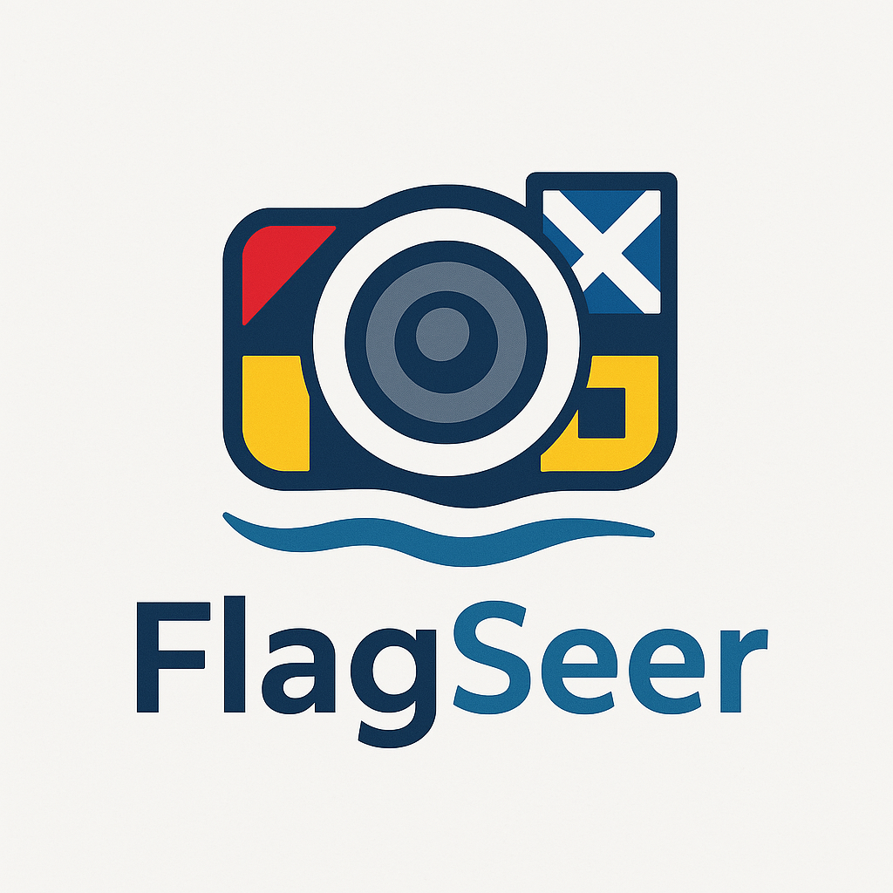

# 🚩 FlagSeer



**FlagSeer**, denizcilikte kullanılan işaret flamalarını canlı kamera görüntüsü üzerinden algılayıp anlamlarını gösteren bir mobil uygulamadır. Denizciler, liman görevlileri ve deniz meraklıları için tasarlanmıştır. Uygulama, yapay zeka ve görüntü işleme teknikleriyle çalışır.

---

## 📱 Platformlar

- ✅ Android (Kotlin)
- ✅ iOS (Swift)
- 🔜 Çoklu platform (Flutter / React Native – Geliştiriliyor)

---

## 🎯 Özellikler

- 📷 Canlı kamera önizlemesi
- 🧠 Cihaz üzerinde çalışan AI modeli (TFLite)
- 🌊 Uluslararası Denizcilik Kodlarına (ICS) uygun yorumlama
- 🛟 İnternet bağlantısına ihtiyaç duymaz (çevrimdışı kullanım için uygundur)

---

## 🗂 Proje Yapısı

```
FlagSeer/
├── android/           # Android Kotlin kodları
│   ├── MainActivity.kt
│   └── activity_main.xml
├── ios/               # iOS Swift kodları
│   ├── FlagSeerApp.swift
│   └── CameraView.swift
├── model/
│   └── flag_model.tflite  # Eğitilmiş TFLite model (örnek)
└── README.md
```

---

## ⚙️ Kurulum

### 📦 Android (Kotlin)

1. `android/` klasörünü Android Studio ile açın.
2. `build.gradle` içinde CameraX kütüphanelerinin tanımlandığından emin olun.
3. `.tflite` modelinizi assets klasörüne ekleyin.
4. Gerçek bir Android cihazda çalıştırın.

### 🍎 iOS (Swift)

1. `ios/` klasörünü Xcode ile açın.
2. `Info.plist` dosyasına kamera izinlerini tanımlayın.
3. Gerçek bir iOS cihazda çalıştırın.

---

## 🧠 Model

Uygulama, A-Z arasındaki denizcilik işaret flamalarını tanımak için özel eğitilmiş bir **TensorFlow Lite** modeli kullanır. Kendi veri setinizle model eğitimi yapabilir ve `.tflite` formatında dışa aktarabilirsiniz.

> **Model dosyası:** `/model/flag_model.tflite`

---

## 📸 Kullanım Senaryosu

- Telefon kamerasını flama taşıyan bir gemiye doğrultun.
- Uygulama, flamaları algılar ve anlamlarını gösterir (örnek: *“Denize adam düştü”*, *“Yardıma ihtiyacım var”*).
- Açık denizde çevrimdışı çalışır.

---

## 👨‍💻 Geliştirici

**Mehmet Turgay AKALIN**  
📍 [https://github.com/makalin](https://github.com/makalin)

---

## 🛠️ Lisans

Bu proje MIT Lisansı ile lisanslanmıştır.

---

## 🌊 FlagSeer ile denizler artık daha akıllı.
